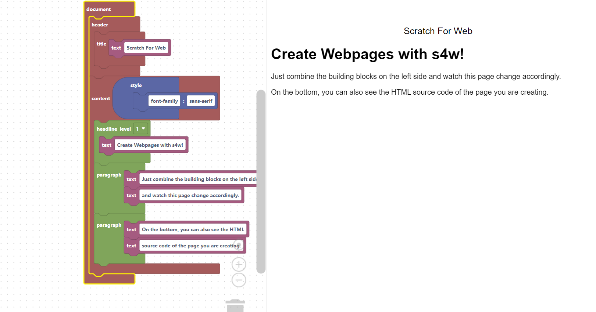

# Scratch For Web
Scratch For Web - Create Dynamic Responsive Webpages fast using blocks!

## Links

Website: https://scratch4web.vercel.app/
Discord: https://discord.gg/57HNMGDvXa

## TODO
 * Support more HTML tags and attributes
 * Enforce HTML tag-nesting rules via types
 * Many more …

## Further ideas
 * Maybe support generating other markup languages (Markdown, LaTeX)
 * Add script-tag and allow for standard Blockly blocks in there

